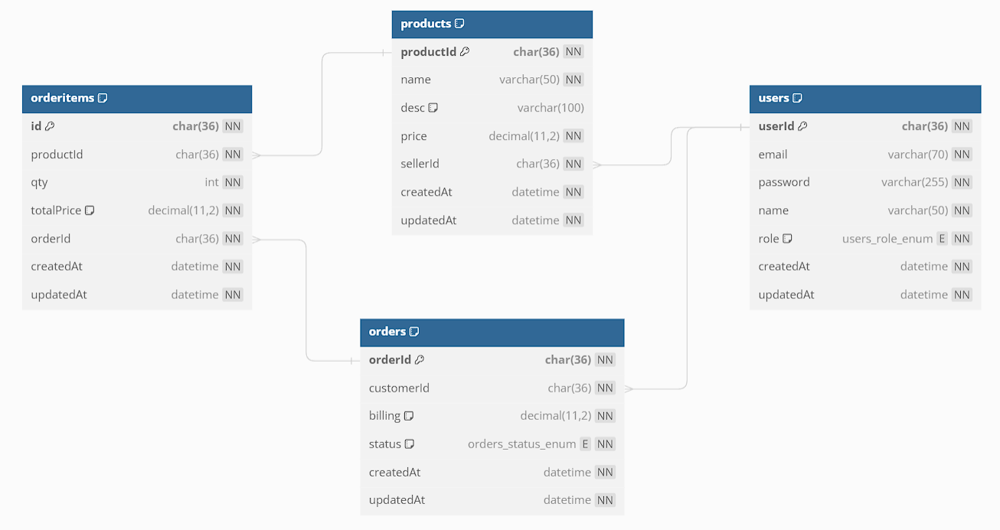

# Backe-End Online Shop Sederhana

API toko online sederhana untuk memenuhi task dari ADS Digital Partner.

<h3>Design Database </h3>

API ini menggunakan RDBMS . Database API ini memiliki 4 tabel. Juga di design menggunakan <a href="https://dbdiagram.io/home">dbdiagram.io</a>

<h3>Fitur API ✨ </h3>
<h4>Auth</h4>

Fitur authentikasi dan autherisasi, dengan 3 endpoint utama yaitu registrasi, login, dan logout. Menggunakan sistem JWT yang di aktifkan pada endpoint login, dan dijadikan validasi pada setiap endpoint yang membutuhkan.

<table>
    <thead>
        <tr>
            <td>No</td>
            <td>Endpoint</td>
            <td>Method</td>
            <td>Keterangan</td>
        </tr>
    </thead>
    <tbody>
         <tr>
            <td>1</td>
            <td>/register</td>
            <td>POST</td>
            <td>Melakukan registrasi akun dengan multi role (seller / customer), dengan inputan wajib yaitu email, password, confirmPassword, dan role</td>
        </tr>
        <tr>
            <td>2</td>
            <td>/login</td>
            <td>POST</td>
            <td>Melakukan login dengan akun yang sudah terdaftar, dengan inputan wajib, yaitu email dan password</td>
        </tr>
        <tr>
            <td>3</td>
            <td>/logout</td>
            <td>GET</td>
            <td>Melakukan login dengan akun yang sudah terdaftar, dengan inputan wajib, yaitu email dan password</td>
        </tr>
    </tbody>
</table>

<h4>Product</h4>

Pada bagian ini, user dengan role seller memiliki akses untuk membuat product, melihat product miliknya, melihat product orang lain, mengedit, serta menghapus product miliknya. Untuk user dengan role customer hanya bisa melihat product yang di sediakan semua seller

<table>
    <thead>
        <tr>
            <td>No</td>
            <td>Endpoint</td>
            <td>Method</td>
            <td>Keterangan</td>
        </tr>
    </thead>
    <tbody>
         <tr>
            <td>1</td>
            <td>/products</td>
            <td>GET</td>
            <td>Menampilkan semua product yang terdaftar di database</td>
        </tr>
        <tr>
            <td>2</td>
            <td>/products/:productId</td>
            <td>GET</td>
            <td>Menampilkan detail product berdasarkan id product</td>
        </tr>
        <tr>
            <td>3</td>
            <td>/products/me</td>
            <td>GET</td>
            <td>Menampilkan product yang dimiliki user (seller), dan endpoint ini hanya bisa di akses oleh user dengan role seller.</td>
        </tr>         
        <tr>
            <td>4</td>
            <td>/products</td>
            <td>POST</td>
            <td>Menambahkan data product baru oleh seller, dengan inputan wajib nama barang, deskripsi barang, dan harga barang</td>
        </tr>
        <tr>
            <td>5</td>
            <td>/products/:productId</td>
            <td>PATCH</td>
            <td>Melakukan edit data product oleh seller berdasarkan id product</td>
        </tr>
        <tr>
            <td>6</td>
            <td>/products/:productId</td>
            <td>DELETE</td>
            <td>Melakukan penghapusan data oleh seller berdasarkan id product</td>
        </tr>
    </tbody>
</table>

<h4>Cart & Orders</h4>

Pada bagian ini, user dengan role seller hanya memiliki akses pada beberapa endpoint yang di gunakan untuk melihat pesanan yang masuk mereka. User dengan role customer dapat melakukan penambahan product ke keranjang belanja, menghapus product yang ada di keranjang belanja, melakukan checkout product yang ada di keranjang belanja 

<table>
    <thead>
        <tr>
            <td>No</td>
            <td>Endpoint</td>
            <td>Method</td>
            <td>Keterangan</td>
        </tr>
    </thead>
    <tbody>
         <tr>
            <td>1</td>
            <td>/cart</td>
            <td>POST</td>
            <td>Menambah product ke keranjang belanja</td>
        </tr>
        <tr>
            <td>2</td>
            <td>/cart</td>
            <td>GET</td>
            <td>Menampilkan daftar prodcut di keranjang</td>
        </tr>
        <tr>
            <td>3</td>
            <td>/cart/:itemId</td>
            <td>DELETE</td>
            <td>Melakukan penghapusan salah satu product di keranjang dengan parameter item Id</td>
        </tr>
        <tr>
            <td>4</td>
            <td>/checkout</td>
            <td>PATCH</td>
            <td>Melakukan pembaruan status dari keranjang menjadi pending atau pra bayar untuk membuat pesanan.</td>
        </tr>         
        <tr>
            <td>5</td>
            <td>/orders</td>
            <td>GET</td>
            <td>Menampilkan daftar product milik seller yang di beli customer</td>
        </tr>
    </tbody>
</table>

<h3>API Documentation 🗎 </h3>

Dokumentasi API ini menggunakan : <a href="https://documenter.getpostman.com/view/27898805/2s9YsGjE9G">ADS Olshop API Documentation</a>

<h3>Kuy cobain projectnya</h3>
<h4>Deskripsi</h4>

API Olshop ADS

<li>Language: Javascript.</li>
<li>Framework: NodeJS</li>
<li>Database: MySQL</li>
<li>ORM: Sequelize</li>
<li>Lastest update: v1.0</li>

Untuk menjalankan API ini secara local, kamu perlu:

<ol>
  <li>Clone repository https://github.com/fajrCode/be3-olshop or download to your local.</li>
  <li>Buka project nya menggunakan editor kesukaanmu (disini saya menggunakan VSCode ya)</li>
  <li>Buka terminal di visual studio code nya</li>
  <li>Jalankan “npm install” untuk menginstall semua package yang digunakan project ini</li>
  <li>Jika kamu ingin menggunakan database yang saya sediakan silahkan import file .sql yang ada di folder db project ini. Namun jika ingin langsung memulai dari awal maka silahkan lanjut ketahap selanjutnya</li>
  <li>Ubah nama file ".env-example" menjadi ".env", kemudian edit .env dan sesuaikan, karena ini masih cukup sederhana maka kamu bisa mengabaikan untuk mengeditnya.</li>
  <li>Selanjutnya kembali ke terminal dan jalankan "npm run dev" (kamu perlu menginstall package tambahan yaitu nodemon), atau "npm run start" untuk menjalankan project.</li>
  <li>Buka postman untuk menguji nya, atau kamu bisa buka browser dan paste url yang ada di .env</li>
  <li>Yeay, kamu berhasil menjalankannya. Silahkan pelajari dan kembangkan, jika ada kritik atau saran jangan sungkan 😊</li>
  <li></> Happy coding </></li>
</ol>

